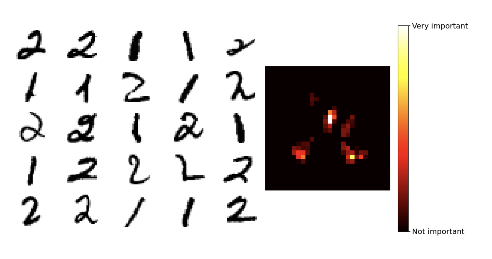
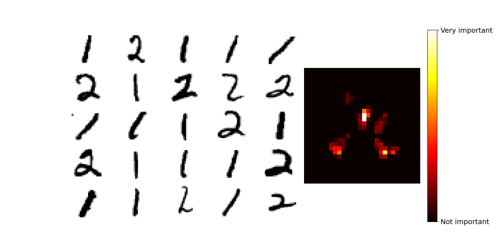

# A Feature Selection Bundle

Feature selection is the task of identifying a subset of the most relevant features from a feature space to improve model training in machine learning. By eliminating non-consistent, redundant and irrelevant features, we reduce the number of input variables, retaining only the features that show the strongest relationship to the target variable. Here, we demonstrate 4 implementations of feature selection methods using the Random Forest learning model. To ensure stability of feature selection, user can specify the number of folds (`numFolds`) for k-fold cross-validation. 
- Boruta
- Recursive Feature Elimination  
- Permutation
- Minimun Redundancy Maximun Relevance (mRMR) 

# Usage

User should initialize the program with the following command line arguments:
`./RandomWalker` `C1` `C2` `C3` `C4` `C5` `C6` `C7`

`C1` Choose from the following feature selection methods:
`Boruta`
`RFE`
`Permutation`
`mRMR`

`C2` Specify input filepath  
**File Format**: Input file must be in CSV format  
**Header Row**: The first row should contain the names of each feature (column headers)  
**First Column**: The first column should contain unique identifiers for each sample  
**Data**: 
- The data file must not contain any empty or missing values
- Irrelevant values should be excluded from the dataset

`C3` Specify numIteration for model training
Ex: 50 will train the model over 50 iterations

`C4` Specify the number of folds for cross validation

`C5` Specify numEstimators for the number of trees generated
Ex: 100 will use 100 decision trees to train the model

`C6` Specify maximun depth of tree

`C7` Specify number of leaves for each tree

Example Input: 

`./RandomForest Boruta "MNIST_dataset.csv" 50 5 200 10 10`


# Random Forest

Random forest is implemented with hyperparameters such as the number of decision trees (`NTrees`), depth of the tree (`MaxDepth`), and size of the leaf (`LeafSize`) for training the model. 


# Boruta

The Boruta algorithm performs by iteratively identifying and removing features with importance scores lower than than of noise features, effectively retaining features of the highest relevance. 

To use the Boruta feature selection method:
- Use the `GridSearchParallel()` method to identify the best set of hyperparameters or proceed with the default parameters
- To select features, run the `Boruta()` function to train the random forest model `numIteration` times, using the `ShuffleShadowFeatures()` method and `trainRandomForestBoruta()` method to shuffle shadow features, train the model 
and update results over each iteration
    ```
    for i := 0; i < numIteration; i++ {

		// Shuffle Shadow features
		d.ShuffleShadowFeatures(featuresToConsider)

		// Train the model and update the results
		trainRandomForestBoruta(d, dLabel, featuresToConsider, numEstimators, maxDepth, numLeaves, results)
    }
    ```

- Train RF with selected features and tunned hyperparameters, then use the `Predict()` method to evaluate model performance on outer test dataset

```
	// Evaluate the model on outer test
	outerTestProcessed := ConvertData(outerTest, outerTest.Features)
	predictions := Predict(&forest, outerTestProcessed)
	f1 := GetF1Score(predictions, outerLabel)
```
Sample output with MNIST database, representing selection of best 50/784 features. 



# RFECV

Recursive feature elimination with cross validation aims to iteratively remove a threshold of features with the lowest feature importance scores until a single feature remains. Threshold is determined by the power law of decay until the 20% feature remains:
$$
\text{threshold} = \text{initial threshold} \times \% \, \text{remaining features} ^ \text{decay factor}
$$

To use RFECV:

- For each fold across `numFolds` use the `trainRandomForestRFE()` method to repeatedly train the random forest model `numIteration` times, keeping track of feature importances
- Use `FeatureDecayScheduler()` to determine a threshold and eliminate features with `DiscardFeatures()`

```
for i := range featuresToConsider {
	for j := 0; j < numIteration; j++ {
		avgFeatureImportance[i] += featureImportances[j][i]
	}
	avgFeatureImportance[i] /= float64(numIteration)
	importanceScores[featuresToConsider[i]] = avgFeatureImportance[i]
}
    ...
    // using power law decay
    threshold := FeatureDecayScheduler(&featuresToConsiderCopy, len(d.Features), lrParams)

    // Discard the features
    DiscardFeatures(featureImportances, &featuresToConsider, threshold)         

```
Sample output with MNIST with the best 50 features selected by RFECV:



# Permutation
Feature selection with permutation aims to permute features one at a time to evalute changes in model performance, resulting in a permutation score for each feature. Feature with positive permutation scores are selected. 

To apply feature selection with permutation:
- Generate a reference random forest with `trainRandomForestPermute()` 
- Permute features with the `PermuteFeature()` function and train a new model with the permuted feature set
- Obtain the average permutation scores for each feature over `numIterations` of model training 
- Result contains average permutation scores in descending order


Sample output with MNIST with the best features selected by permutation:


# mRMR

mRMR selects the best feature set with the least amount of redundancy. 

To apply mRMR:

- Standardize and discretize input dataset with the `mRMR_Discrete()` function
    - Use `RelevanceMI()` to calculate mutual information between features and class labels to determine their relevancy
    - Features with relevance MI of 0 are discarded
    - Calculate and update redundancy information with `RedundancyMIUpdate()` and combine redundancy and relevance score with `PairwiseDeduction()`

# Marker Mate 

Marker mate is an application developed with RShiny to visualize the implementation of different feature selection methods on the MNIST dataset.

Video demonstration of Marker Mate can be downloaded trough google drive:
https://drive.google.com/uc?id=1VkYm8d5-HAkW-enFcEzI-_VrrLcn18cO&export=download

# Acknowledgements


